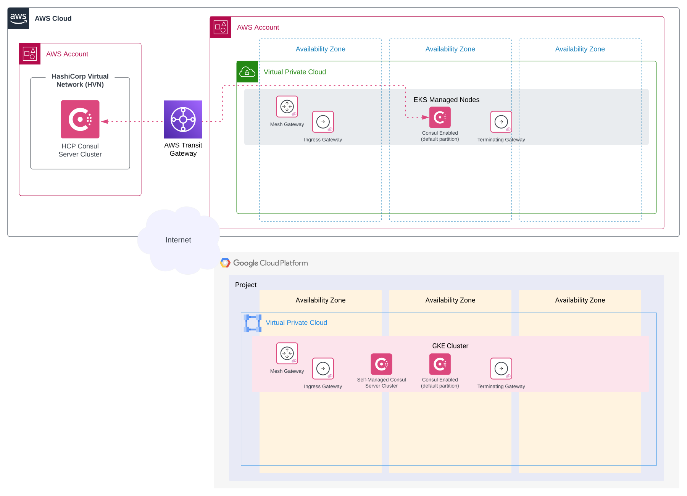

<h1>
  
  <span>The Sandpit</span>
</h1>

# Overview

The sandpit is a self-contained deployable environment that assumes no existing cloud infrastructure. The objective is to model a production-like environment logically while balancing non-logical elements to minimise cloud resources and associated costs. 

Once deployed, the sandpit will provide an environment that can be customised and used for debugging, testing and demonstrating Consul.

Deployable patterns can be layered on top to demonstrate different scenarios and use cases.

# Architecture

The environment predominantly uses HashiCorp Cloud Platform (HCP) services with Amazon Web Services (AWS) and Google Cloud Platform (GCP) to enable multi-cloud capabilities. However, to depict more “real-world” scenarios, self-managed instances are also employed to allow such patterns as HCP Consul peering with self-managed platforms (e.g. cloud to on-premise).

With customers shifting workloads towards microservices and Consul being operated primarily for service mesh use cases, this environment leverages Kubernetes as the primary container orchestration platform.

## Non-Logical Diagram



## Infrastructure Components

The terraform module deploys ~106 resources. The major components include:

**HCP**
- HashiCorp Virtual Network (HVN)
- HVN to AWS Transit Gateway (TGW) attachment and associated routes

**AWS**
- Virtual Private Cloud (VPC), associated subnets, route tables, and gateways
- Transit Gateway (TGW)
- Security Groups
- Key Pair
- Elastic Compute Cloud (EC2) instance (bastion host)
- Elastic Kubernetes Service (EKS) cluster

**GCP**
- Virtual Private Cloud (VPC), associated subnets, route tables, and gateways
- Google Kubernetes Engine (GKE) cluster

# Prerequisites

The environment assumes you have an active HashiCorp Cloud Platform (HCP), Amazon Web Services (AWS) and Google Cloud Platform (GCP) subscription with the necessary privileges to deploy the required infrastructure components. Additionally, a Consul Enterprise license is required. Review the following instructions to ensure you meet the requirements for this module to deploy successfully:

**1. HCP**

- Create an HCP account. For more information, visit the [*Create an HCP Account*](https://developer.hashicorp.com/hcp/docs/hcp/create-account) page.
- Obtain the `hcp_client_id` and `hcp_client_secret` by creating a Service Principle and associated Service Principal Key. For detailed steps, visit the [*Create a Service Principle*](https://developer.hashicorp.com/hcp/docs/hcp/security/service-principals) page.

The Terraform HCP Provider authenticates via a Client ID and a Client Secret.

**2. AWS**

- Create an AWS account. For more information, visit the [*Create and Activate an AWS Account*](https://aws.amazon.com/premiumsupport/knowledge-center/create-and-activate-aws-account) page.
- Install the AWS Command Line Interface (AWS CLI). For detailed steps, visit the [*Installing or upgrading the AWS CLI*](https://docs.aws.amazon.com/cli/latest/userguide/getting-started-install.html) page.
- Configure the AWS CLI. For detailed steps, visit the [*Configuration basics*](https://docs.aws.amazon.com/cli/latest/userguide/cli-configure-quickstart.html#cli-configure-quickstart-creds) page.

The Terraform AWS Provider authenticates via the AWS CLI rather than directly providing the `access_key` and `secret_key` in the provider configuration.

**3. GCP**

- Create a GCP account. For more information, visit the [*Getting Started*](https://cloud.google.com/docs/get-started) page.
- Install the Google Cloud CLI (gcloud CLI). For detailed steps, visit the [*Install the Google Cloud CLI*](https://cloud.google.com/sdk/docs/install-sdk) page.
- Configure the gcloud CLI. For detailed steps, visit the [*Initializing the gcloud CLI*](https://cloud.google.com/sdk/docs/initializing) page.

`gcloud init` will set the default project used by the gcloud CLI, but if this step is not complete or you wish to change the project id, complete the following additional steps:

- Obtain the GCP project id by executing `gcloud projects list`. If no projects exist, or to create a project, visit [*Creating and managing projects*](https://cloud.google.com/resource-manager/docs/creating-managing-projects) page.
- Execute `gcloud config set project <PROJECT_ID>`

# Usage

1. Execute `git clone https://github.com/phan-t/terraform-consul-sandpit.git`
2. Rename `terraform.tfvars.example` to `terraform.tfvars` in the root directory or alternative create a new `terraform.tfvars`
3. Add required input values to `terraform.tfvars`
   
   Example `terraform.tfvars`:
   ```hcl
   deployment_name = "consul-sandpit"
   hcp_client_id = "xxxxxxxxxxxxxxxxxxxxxxxxxxxxxxxx"
   hcp_client_secret = "xxxxxxxxxxxxxxxxxxxxxxxxxxxxxxxx"
   aws_region = "ap-southeast-2"
   gcp_region = "australia-southeast1"
   gcp_project_id = "xxxxxxxxxxxxxxxxxxxxxxxxxxxxxxxx"
   consul_helm_chart_version = "1.0.4"
   consul_version = "1.14.4"
   consul_ent_license = "xxxxxxxxxxxxxxxxxxxxxxxxxxxxxxxx"
   ```
4. Run `terraform init`
5. Run `terraform plan`
6. Run `terraform apply`

## Post Deployment

- kubeconfig file is updated to include the deployed EKS and GKE clusters
- AWS key pair pem file is created in the root directory

## Clean-Up

1. Run `terraform destroy`
2. Remove associated Kubernetes contexts from the kubeconfig file